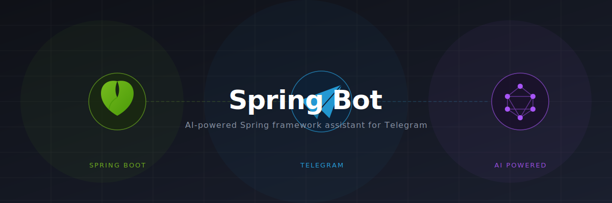

# Spring Bot



A Telegram bot built with Spring Boot that provides AI-powered Spring framework assistance with multi-language support and expert consultation features.

## Features

- **AI Q&A** — Ask questions about the Spring framework, answered by an AI in 1-3 concise sentences
- **Expert System** — Consult one of 7 virtual Spring experts, each with a specialized persona (Security, Data, DevOps, etc.)
- **Random Facts** — Generate random Spring framework facts on demand
- **Multi-Language** — Supports English and Hebrew, switchable per user
- **Session Management** — Per-user state and preferences persisted in PostgreSQL
- **REST API** — Expose AI features via HTTP endpoints

## Tech Stack

| Layer | Technology |
|---|---|
| Framework | Spring Boot 3.5.9 |
| Language | Java 25 |
| Build | Gradle |
| Telegram | TelegramBots 9.2.0 (long polling) |
| AI | Spring AI + OpenRouter API |
| Database | PostgreSQL + Spring Data JDBC |
| Migrations | Liquibase |
| Deployment | Docker (multi-stage), AWS ECR |

## Getting Started

### Prerequisites

- Java 25
- Docker & Docker Compose
- A Telegram bot token (from [@BotFather](https://t.me/BotFather))
- An OpenRouter API key

### Environment Variables

Create a `secret.env` file (see `secret.env` in the repo as a template):

```env
BOT_TOKEN=your_telegram_bot_token
OPENAI_API_KEY=your_openrouter_api_key

# Optional — defaults shown
POSTGRES_HOST=localhost
POSTGRES_PORT=5432
POSTGRES_DB=telegram-bot
POSTGRES_USER=root
POSTGRES_PASSWORD=root
OPENAI_API_BASE_URL=https://openrouter.ai/api
OPENAI_MODEL=allenai/olmo-3.1-32b-think:free
```

### Run with Docker Compose

```bash
docker compose up
```

The application starts on port `8080`.

### Run Locally

```bash
./gradlew bootRun
```

Make sure PostgreSQL is running and `secret.env` values are exported to your environment.

## REST API

| Method | Path | Description |
|--------|------|-------------|
| `GET` | `/ai/fact` | Random Spring framework fact |
| `POST` | `/ai/question` | Answer a Spring-related question |
| `POST` | `/ai/ask-expert` | Answer a question through a specific expert persona |

## Bot Commands

| Command | Description |
|---------|-------------|
| `/start` | Initialize session and show main menu |
| `/ask` | Ask a general Spring question |
| `/experts` | Browse and select a virtual expert |
| `/fact` | Get a random Spring fact |
| `/language` | Switch language (English / Hebrew) |
| `/about` | About this bot |

## Experts

The bot includes 7 virtual Spring experts:

- **Yuval Ben David** — Spring Tools
- **Omer Levy** — Spring Security
- **Daniel Rosen** — Spring Data
- **Shlomi Hakim** — Databases
- **Nadav Hakim** — Databases
- **Aviad Cohen** — Containerization
- **Yonatan Barak** — General Spring

## Project Structure

```
src/main/java/com/andreibel/springbot/
├── SpringBotApplication.java
├── bot/
│   ├── MainBot.java                  # Long-polling bot entry point
│   ├── commands/                     # One class per bot command
│   ├── config/                       # Telegram & localization beans
│   ├── events/                       # Event-driven message dispatch
│   ├── model/                        # UserSession entity & repository
│   └── service/                      # AI, session, localization, keyboard
└── rest/controller/
    └── AiController.java             # REST API endpoints
```

## Database

Schema is managed by Liquibase. A single `user_session` table stores per-user state:

| Column | Description |
|--------|-------------|
| `chat_id` | Telegram chat identifier |
| `locale` | User language preference |
| `firest_name` | User's first name |
| `selected_expert_id` | Currently selected expert |
| `user_states` | Conversation state (`IDLE`, `WAITING_FOR_QUESTION`, `WAITING_FOR_EXPERT_QUESTION`) |